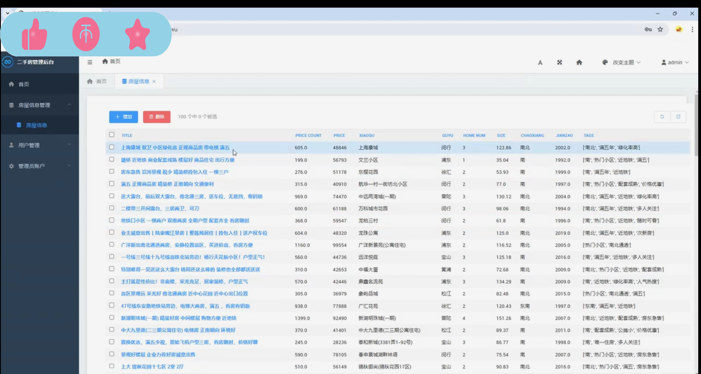
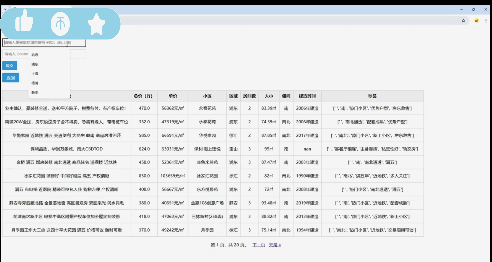

## 计算机毕业设计Hadoop二手房价格预测系统 二手房可视化大屏 Python爬虫(源码+LW+PPT+讲解)

## 要求
### 源码有偿！一套(论文 PPT 源码+sql脚本+教程)

### 
### 加好友前帮忙start一下，并备注github有偿hadoop二手房
### V : biyesheji1698 大模型、大数据、深度学习领域中科院硕士在读，所有源码均一手开发！招合伙人！

# 

### 加qq好友说明（被部分 网友整得心力交瘁）：
    1.加好友务必按照格式备注
    2.避免浪费各自的时间！
    3.当“客服”不容易，repo 主是体面人，不爆粗，性格好，文明人。
## 介绍
环境搭建：
Linux(Centos7)
Hadoop,Spark,Zookeeper,Kafka,Hbase...
大数据组件工具IDEA，Xshell， xftp，Sqlyog
Mysql

数据采集：
Python 58同城二手房数据

数据存储：
Mysql、 HDFS
清洗后的数据存储到HDFS
分析完的数据存储在Mysql

数据分析：
不同建造时间的房屋数量、不同区城占比、区域二手房平均价格、地区面积数量、不同户型的房屋数量、
不同地区朝向数量、不同地区房屋总数

业务系统：
Django/大屏
柱状图、折线图、饼图

## 演示视频
https://www.bilibili.com/video/BV1E3gCzcExq

## 演示运行截图

